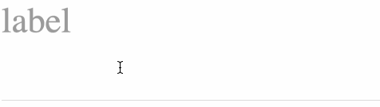

# react-floating-label-input


[![License][license-image]][license-url]
[![Downloads][downloads-image]][downloads-url]


[![npm badge][npm-badge-png]][package-url]

A floating label component for React. It inherits the font-size from the parent.



Try it yourself at the [Storybook](http://blog.cymen.org/react-floating-label-input).

## Example

```jsx
import React from 'react';
import FloatingLabelInput from 'react-floating-label-input';

export default ({ onChange, value }) =>
  <div style={{ fontSize: 64 }}>
    <FloatingLabelInput
      id="example-3"
      label="label"
      onBlur={action('onBlur')}
      onChange={action('onChange')}
      onFocus={action('onFocus')}
      value={value}
    />
  </div>;
```

## Props

| name         | optional | default    |
|--------------|----------|------------|
| className    | yes	  |            |
| fontSize     | yes      | inherit    |
| id           | no       |            |
| label        | no       |            |
| onBlur       | yes      |            |
| onChange     | no       |            |
| onFocus      | yes      |            |
| placeholder  | yes      | ''         |
| refs         | yes      |            |
| type         | yes      | text       |
| value        | yes      | ''         |

* `refs` is set as `ref` prop on `input`

## Dependencies

Peer dependencies:

* react
* styled-components

## License

[MIT](LICENSE)

[package-url]: https://npmjs.org/package/react-floating-label-input
[npm-version-svg]: http://versionbadg.es/cymen/react-floating-label-input.svg
[npm-badge-png]: https://nodei.co/npm/react-floating-label-input.png?downloads=true&stars=true
[license-image]: http://img.shields.io/npm/l/react-floating-label-input.svg
[license-url]: LICENSE
[downloads-image]: http://img.shields.io/npm/dm/react-floating-label-input.svg
[downloads-url]: http://npm-stat.com/charts.html?package=react-floating-label-input
